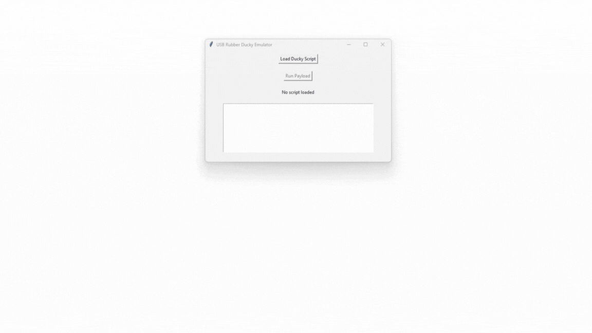
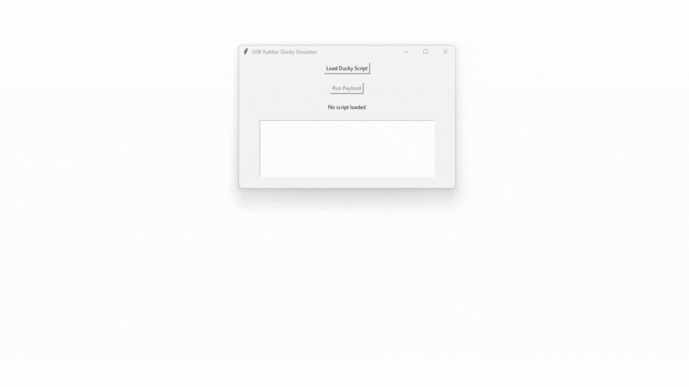
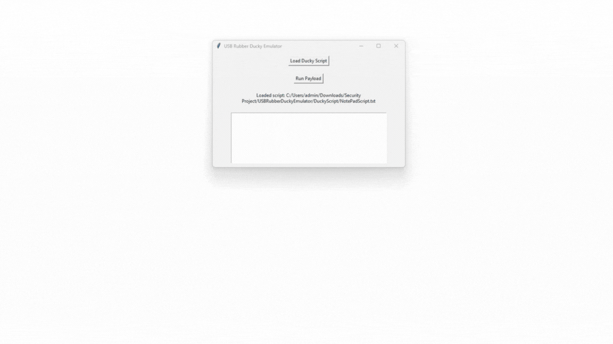
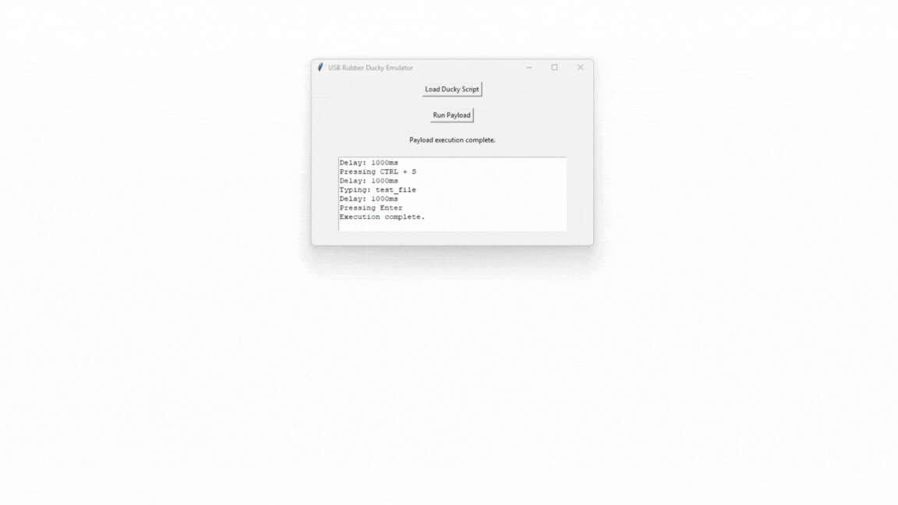
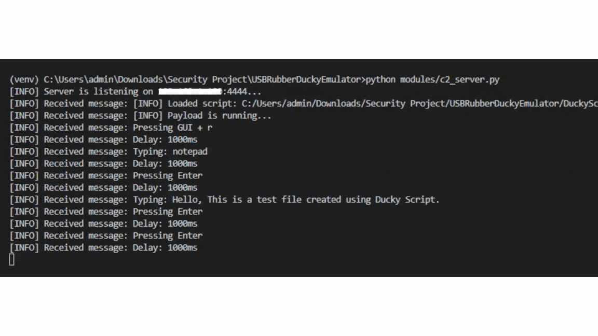

# USB Rubber Ducky Emulator

## About the app
This project is a desktop application developed for educational purposes, focusing on simulating USB Rubber Ducky attacks. It enables remote control and execution of commands on a target machine. The application integrates with a C2 (Command and Control) server to monitor scripts during the simulated Rubber Ducky attack.

## How to use and what you need
* The **`requirements.txt`** file specifies the primary libraries used in the project:
    * **tkinter**: Used for creating the GUI.
    * **pynput**: Used for simulating keyboard input and enabling remote control.
    * **socket**: Used for managing server communication and monitoring scripts.

* To run the application, please follow these steps:
    * **Follow the tutorial**: Refer to the `tutorial.txt` file for detailed instructions.

## Basic usage
1. Create a Python virtual environment.
2. Activate the virtual environment.
3. Install the required libraries using **`pip install -r requirements.txt`**.
4. Create a `.env` file based on the `.env.example`, and enter your C2 server's IP address and port.
5. Launch the C2 Server by executing the command **`python modules/c2_server.py`**.
6. Open a new terminal and start the Desktop Application using the command **`python main.py`**.
7. To close the C2 Server, using the command **`Ctrl + C`**.
8. To close the application, either click the close button in the top-right corner or press **`Ctrl + C`**.

## Introduction to the website
This project simulates USB Rubber Ducky attacks, enabling remote control of a target computer by executing predefined command scripts. Unlike traditional Rubber Ducky attacks, this application eliminates the need for a physical USB device. Once a script is loaded and the payload is executed, the application takes control of the user's keyboard and performs the actions specified in the script.

## Website details

When the application is launched, it displays the following interface

When a script is loaded, the application displays the script's location on the user's computer

After loading the script and clicking "Run Payload," the application remotely controls the target computer

After the payload execution is complete, the application displays an activity log

The following log is sent to the C2 server

### Postscript
This project is developed for educational purposes, focusing on the study of USB Rubber Ducky attacks and basic library usage. The developer has no intention of using this project for illegal activities and does not condone its use for any unlawful purposes. Finally, I would like to thank everyone who has viewed my project. Any suggestions or feedback are welcome. Thank you.